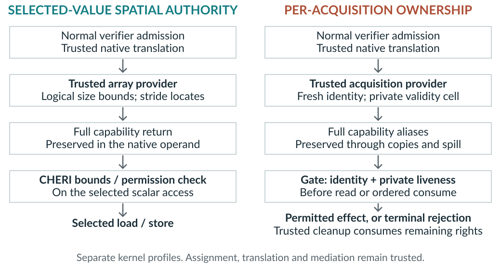

# Focused related work and contribution boundary

This comparison of primary sources covers selected array-value authority and
per-acquisition kfunc validity. Claims apply to the cited versions; their
implementations and evaluations were not independently reproduced. The
[trust taxonomy](trust-taxonomy.md) compares their conditional proof bases;
the [claim map](claim-evidence.md) identifies the evidence for cBPF's bindings.

## Established foundations

**CHERI and Morello.** CHERI supplies unforgeable capabilities, bounds and
permissions, and monotonic derivation of ordinary capabilities. Its report
also describes retaining wider authority to derive narrower authority and the
need to exclude allocator metadata from exposed bounds. These are established
mechanisms, not cBPF inventions. [An Introduction to CHERI, §§2.3 and 2.7,
September 2019 report with revisions through July 2020](https://www.cl.cam.ac.uk/techreports/UCAM-CL-TR-941.pdf).
Morello integrates CHERI with ARMv8-A as an experimental architecture;
it is cBPF's execution substrate. [Cambridge Morello project description](https://www.cl.cam.ac.uk/research/security/ctsrd/cheri/cheri-morello.html).
cBPF's additional obligation is checked logical-value assignment and native
use, stated in the [spatial premises](../../theory/spatial.md).

**Linux ownership contract.** In Linux 6.7, `KF_ACQUIRE` marks a returned
reference that the verifier requires to be released or transferred through a
referenced kptr; `KF_RET_NULL` requires a NULL check before use. `KF_RELEASE`
invalidates all copies of the released pointer. cBPF therefore studies runtime
enforcement of an existing ownership obligation, not a missing Linux rule.
[Linux 6.7 kfunc documentation, §§2.4.1–2.4.3](https://docs.kernel.org/6.7/bpf/kfuncs.html#kf-acquire-flag).
cBPF excludes kptr transfer and the full kfunc interface.
Linux also already checks map-value accesses against `value_size`.
[Linux 6.7 verifier, `check_map_access`](https://github.com/torvalds/linux/blob/v6.7/kernel/bpf/verifier.c).

**CETS.** CETS associates pointers with an allocation key and a shared lock
location, propagates this metadata through pointer operations, and rejects
stale keys at access. It also checks deallocation rights; its temporal-safety
argument assumes spatial safety or a companion spatial-safety mechanism.
[Nagarakatte et al., ISMM 2010, §§3.1–3.3](https://people.cs.rutgers.edu/~sn349/papers/ismm10-cets.pdf).
cBPF's owning identity denotes one successful acquisition: A and B can name
the same still-allocated object, while releasing A consumes only A's right.
This changes the lifetime represented; fresh identities, shared invalidation
and alias metadata remain prior art. The concrete transport and consumption
obligation is summarized below.

## Closest eBPF systems

**Research direction.** Huang et al.’s [IEEE S&P 2025 SoK, §8.4.2](https://hexhive.epfl.ch/publications/files/25Oakland.pdf#page=14) explicitly proposes CHERI for finer-grained eBPF isolation. cBPF turns that direction into two evaluated interface bindings. The contribution lies in their design, native integration and evidence; it does not require inventing a new capability architecture.

**HIVE (USENIX Security 2024)** isolates BPF memory using AArch64 unprivileged
load/store instructions and handles kernel-object access using pointer types,
pointer authentication, and type descriptor tables. Its descriptor path also
recovers kernel pointers for helper arguments and restores descriptors after
the call. [Zhang et al., abstract and §5.3.3](https://www.usenix.org/system/files/usenixsecurity24-zhang-peihua.pdf).
Runtime isolation, typed kernel-object mediation and helper handling are
therefore direct prior work.

**HIVE's 1 June 2026 project update** makes a particularly useful boundary
explicit: its authentication modifier combines execution identity and pointer
type; same-type pointers may substitute within one invocation, and the design
deliberately omits per-pointer freshness. This is the authors' description of
that design, not an inferred implementation defect. [Wang and Zhang, Part 3,
“The Design of the Modifier and the Sign Operation”](https://ebpf.foundation/research-update-isolated-execution-environment-for-ebpf-part-3/).
cBPF studies independent A/B validity for the same object. This comparison
does not demonstrate a HIVE vulnerability or absence of an equivalent
mechanism in other HIVE versions.

**AEE (USENIX Security 2025)** separates verifier state approximation from
safety checks, then instruments execution to remain within the approximations;
states outside them terminate. It applies this approach to eBPF spatial memory
safety at **object granularity**, including cross-region violations, while
retaining trusted static safety checks.
[Sun and Su, §§7.3 and 8, pp. 7479–7480](https://www.usenix.org/system/files/usenixsecurity25-sun-hao.pdf).
Its implementation also uses Arm pointer authentication for spill/fill
metadata (§5). Granularity alone cannot distinguish cBPF from AEE. The
[trust taxonomy](trust-taxonomy.md) compares their conditional proof bases;
cBPF establishes no smaller trusted base or superiority.

**Kops (June 2026 preprint)** pairs verifier-checked eBPF sequences with native
implementations using BTF/kfunc registration.
[Kops, §§4–6](https://arxiv.org/html/2606.24213v1#S4).
Native lowering and retained verification are prior work; this comparison
does not establish that cBPF's policies are inexpressible in Kops.

**MOAT (USENIX Security 2024)** uses Intel Memory Protection Keys, specifically
supervisor keys, for BPF isolation and includes two-layer isolation and helper
protection. [Lu et al., abstract, §2.2 and §4](https://fengweiz.github.io/paper/moat-usenixsecurity24.pdf).
Its helper protection is relevant prior art; no undocumented ownership gap
is inferred.

**SafeBPF (CCSW 2024)** provides software address masking and hardware memory
tagging approaches to eBPF sandbox enforcement, including a synchronous Arm
MTE configuration. [SafeBPF, §§5.2–5.3](https://tfjmp.org/publications/2024-ccsw.pdf).
Both software and hardware-assisted runtime containment are established;
changing the hardware primitive alone is not cBPF's contribution.

**KRAKENGUARD (NSDI 2026)** is a trusted user-space manager that symbolically
checks policies on helpers, memory, maps, and return values before loading,
and considers interference between programs. [Patel et al., abstract and
§3.2](https://www.usenix.org/system/files/nsdi26-patel.pdf).
Its load-time policy mechanism differs from cBPF's runtime-selected interval
and consumption checks; neither subsumption nor inexpressibility follows.

**CHERI GPU-driver work (CCS 2025)** includes a uBPF-derived interpreter for
initial interrupt handling, with CHERI bounding access to device MMIO; that
specific interpreter explicitly excludes eBPF maps and helper functions.
[Metzger et al., §5.3](https://www.cl.cam.ac.uk/research/security/ctsrd/pdfs/202510-ccs-gpu-driver-compartments.pdf).
cBPF cannot claim the first CHERI/eBPF implementation. Its candidate scope is
the Linux array-provider/native-access mapping and the bounded kfunc protocol.

## Defensible positioning and present evidence

| Concrete contribution | Closest established result | Additional design obligation and evidence limit |
|---|---|---|
| Selected semantic extent reaches and constrains native access. | CHERI already supports subobject bounds; Linux defines map-value access; AEE already supplies object-level enforcement. | Use stride to locate the value but logical size to grant authority. The [selective matrix](../results/spatial-selectivity.md) observes exact-seven rejection of padding, the next slot and a crossing access against matched stride-eight/both-slot controls. This is selected synthetic-native evidence; all-program mediation is unproved. |
| Alias transport preserves an independently consumable right through failure. | Linux tracks owning references; CETS propagates identity and shared invalidation; native lowering and typed helper mediation have prior art. | Preserve acquisition identity/validity through complete-capability copies/spills, clear validity before the effect and define terminal cleanup. The [integrated native trace](../results/ownership-native-trace.md) connects independent-B use, stale rejection, skipped continuation and cleanup. This is a restricted trusted fixture, not normally verified stale BPF or general temporal safety. |

The [software comparison](capability-comparison.md) specifies protected shadow
identities and descriptors that can enforce the same abstract policy under
matched scope and premises. CHERI's representation is the studied realization,
not a demonstrated requirement for that policy.

Exact bounds trade generality for precision: the selected-value provider
rejects unsupported profiles and inexact construction. Its correct association
of provider, key, layout and retained allocation root remains trusted. The
native witness connects the return in `c0`, a full-capability copy into `c7`,
and two accesses through unchanged `c7`; broader gateway and RDDC authority
still exist. The [historical causal comparison](../results/causal-review.md#what-the-historical-comparisons-establish)
shows why constructing an exact candidate is insufficient when a broader
capability is actually returned.

Ownership instead preserves an existing acquisition identity across copies
and a logical eight-byte spill represented by a sixteen-byte native sidecar.
The gate compares the complete public view with its canonical acquisition and
checks protected validity before an object effect. Consumption clears the
private stored object capability; public aliases retain their tags and fail
the gate's liveness check. Two private cells, fixed gates, restricted transport
and no cell reuse during an invocation constrain this implementation. The
sidecar is an implementation choice, not a new aliasing mechanism or global
capability revocation.

[ownership CVE case](../results/ownership-cve-case.md) adds a conditional
CVE-derived ownership case and the integrated trusted-native production-path
trace. It does not execute the original callback path or equate consume-once
validity with upstream callback release eligibility. [trusted callback witness](../../evidence/current/ownership-callback/README.md)
adds actual trusted C callback/context transport, not protected BPF callback
execution. The spatial CVE comparison remains an archived metadata-read-stage
result, while the new selective matrix is a current non-CVE runtime control.
These examples establish relevance at different evidence levels;
neither CVE label is needed to state the contribution.
The [causal analysis](../results/causal-review.md) locates the supporting evidence.
Composition, comparative performance/security, smaller trust and universal
verifier-fault tolerance remain unestablished. The HIVE update is an author
report distinct from its 2024 paper; Morello's project page supplies
architectural context. The comparison is limited to the cited systems and versions; it is not an
exhaustive survey.

## Direct predecessor and revocable proxies

Leaf's [Morello eBPF RFC](https://op-lists.linaro.org/archives/list/linux-morello@op-lists.linaro.org/message/LBV3YQWCTQRERLGNRU5ML7VA3JVQSDNQ/)
identifies capability-aware execution, helper and kfunc transitions, pointer
filtering and hybrid-ABI boundaries as integration concerns. cBPF builds on
that execution substrate and its earlier local prototype. The evaluated
contribution concerns selected-value and acquisition-specific bindings, not
a new general JIT or a solution to general helper-argument filtering.

[Miller and Shapiro, Section 4.3](https://www.erights.org/talks/asian03/paradigm-revised.pdf) provide the closer caretaker/revoker
comparison. Independent A/B revocation is inferred from separate protected
targets; selective revocation is prior art. cBPF's incremental finding is the
coupling to counted acquisitions, full native transport and ordered effects.
No comparative advantage from CHERI is established by this evaluation.

## Source lineage and design rationale

| Origin | Role in cBPF |
|---|---|
| Published mechanisms and platform | Linux/eBPF contracts, CHERI/Morello authority, shared invalidation, Arm/Linaro infrastructure and Leaf's execution/transition substrate are established foundations. |
| Earlier cBPF prototype | The spatial provider, transition/gateway work, adjacent-value controls and archived CVE-stage observations belong to the same local research trajectory. The reduced provider narrows that implementation; historical outcomes remain tied to their original source epochs. |
| Maintained research contribution | Two bounded interface bindings, conditional arguments and counterexamples, restricted native ownership mapping, discriminating controls and the resulting design synthesis. Their engineering realizes established mechanisms rather than introducing new capability primitives. |

The [spatial ancestry](../../linux/spatial/README.md#ancestry-reduction-and-evidence),
[ownership ancestry](../../linux/ownership/README.md#source-and-reproduction) and
[historical provenance](../../evidence/provenance.json) identify the source
lineage. Imported Git history and source chronology do not establish personal
authorship. OpenAI Codex assisted implementation, source review, analysis and
documentation. This assistance is distinct from the inherited platform and
the research contributions identified above.

The evaluated study retains the verifier and isolates two feasibility
questions; it establishes neither verifier relaxation, general temporal
safety nor comparative performance. Unequal value size and stride
distinguish two plausible constructors; A, its alias and independent B
distinguish copying, acquisition and current validity. The integrated trusted
native fixture additionally tests rejection, termination and cleanup; trusted
callbacks test persistence through dispatch. These controls answer different
questions and do not form a combined runtime or normally verified stale-BPF
execution.

The reusable method is to identify the semantic grant, retain every distinction
needed at its effect boundary, and choose a control that separates the intended
representation from a plausible incorrect one. The
[decision-representability criterion](../../theory/acquisition-distinguishability.md)
is elementary: identical consulted observations must require identical policy
decisions. Its application to acquisition A/B is useful here; it is not a new
general theorem or a metadata lower bound. Additional protected provenance can
satisfy the criterion without cBPF's cells.

The same reasoning applies to spatial grants. Consider two contexts with the
same selected address, stride eight, allocation bounds and permissions, but
logical lengths seven and eight. A one-byte request at offset seven requires
different outcomes. If both contexts expose only an eight-byte grant and no
consulted metadata records logical size, a downstream bounds decision cannot
recover that distinction. Exact logical bounds preserve it; a protected
length descriptor could also do so. This is a counterfactual argument, not an
executed padding access.

| Reusable finding | Knowledge established and discriminating evidence | Insufficient representation |
|---|---|---|
| Logical extent differs from storage layout. | Stride locates a value; its interface contract determines authority. Exact-seven rejects padding/adjacent/crossing accesses that selected wider controls permit. | Stride-only bounds cannot exclude padding and therefore erase the required distinction. |
| An object differs from an acquisition. | A and B designate one object but require independent consume decisions; B reads 42 after A is consumed. | Object-only identity invalidates both rights or permits stale A; aggregate reference counts cannot select the live right. |
| Preserved identity needs current validity. | Copies/spills retain A's tagged canonical identity after consumption, while protected validity makes its next use reject. | Immutable identity without associated validity cannot distinguish histories in which that same identity is live or consumed. |
| Rejection needs a defined execution boundary. | Stale rejection skips the remaining native effect and trusted cleanup consumes B exactly once. | Preventing one object effect without terminal continuation and obligation accounting leaves later effects or leaks unresolved. |

Every row depends on trustworthy assignment, protected state where required,
actual operand/gate use, ordered effects and terminal handling. These are
observed only for the bounded fixtures named above. A protected software
descriptor can retain the same distinctions; CHERI supplies integrity and
architectural use checks for the studied representation, not a claim that the
policies require CHERI.

The spatial profile follows the selected grant to its native memory operand.
The ownership profile follows an acquisition identity to a gate that checks
private validity before its effect. The implementations remain separate;
the diagram does not establish their composition or complete mediation.
